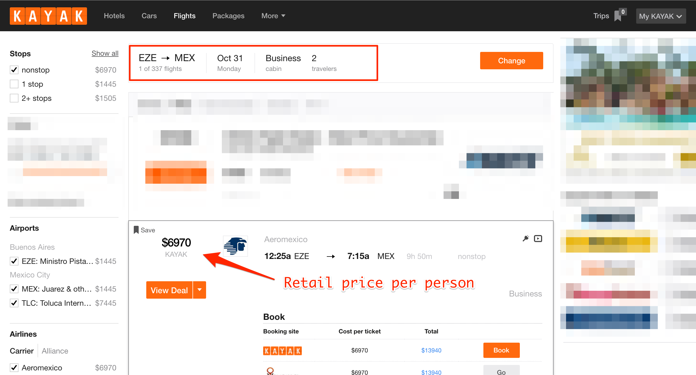

import MediaWide from '@components/MediaWide.astro'

_There are thousands of articles on the internet on "travel hacking". A quick search on Google for "how to get free flights" will give you over 33 million results. This guide is my attempt at writing a simplified version so you can get your next flight for FREE (whether it's in economy or first class) in the next 30 days._

* * *

10 countries. 

20+ cities.

3 continents. 

And over 30,000 miles flown.

In the last 12 months, my girlfriend and I flew all over the world and have lived in countries like Thailand, Indonesia, Philippines, Canada, Chile, Argentina, Mexico, and many others.

After talking to a few people about our trip, it seems like there's this misconception that we ended up emptying our wallets for our travels.

The funny thing is, we actually spent _less_ money living abroad than living at home (but that's a whole 'nother topic for another time).

Today, I want to talk about how we were able to save thousands of dollars on our flights.

I'll tell you exactly what we did to get about $20,000 worth of flights for $876…

…and I'll show you what you need to do so you can fly anywhere in the world for free (you just have to pay taxes and fees).

It doesn't matter if you fly coach or in a $7,000 first or business class seat. You'll get your next flight for pretty much nothing.

But first, a quick summary:

* This "travel hack" was made possible by leveraging the power of credit cards.
* All of the points/miles I earned happened "on the ground" without having to take a single flight.
* After earning the points, you then transfer them to the airline you want to fly on.
* These points essentially turn into frequent flyer miles.
* You don't need a lot of credit cards to do this.
* You don't need to manufacture any spending — you can get points/miles with the purchases you're already making.
* This stuff isn't a gimmick, it's not illegal, and it certainly isn't time-consuming.

**Also, a very important prerequisite**: you _must_ be responsible with your money.

You'll be using credit cards for this travel hack.

Do NOT bother reading the rest of this post if you already have a ton of credit card debt.

And if you do, close this page, work on paying off your current credit card debt, and come back to this article only after you've done that.

## The Breakdown: $19,431 Worth of (International) Flights for $876

Since I paid for most of our flights using points & miles, I think showing you a breakdown would be the best place to start so you can get an idea of what they would've cost us.

**First, a disclaimer**: the chart below doesn't include all the flights that we purchased. I used my points & miles solely on international flights. I definitely spent more than $876 on flights for our year-long trip. But for the purpose of this guide, I didn't include all the other flights we purchased outright at retail price (like the cheaper domestic flights).

<MediaWide>

</MediaWide>

So as you can see, all these (one-way) flights would've cost us over $19k.

Our total cost? $876 in taxes and fees.

And if it wasn't for the last minute booking fee for our flight from Chicago to Santiago, Chile, the total actually would've only been $726.

<MediaWide>

</MediaWide>

A big chunk of the savings was for the 10-hour flight from Buenos Aires to Mexico City where we — for the first time in our lives — flew in business class. Those seats were normally $6,970 each (crazy expensive, I know).

We got 'em for a grand total of $195 in taxes and fees.

<MediaWide>

</MediaWide>

<MediaWide>

</MediaWide>

## How I Earned Over 500,000 Miles Without Flying (and How You Can Too)

Ever since I started travel hacking, I've earned more than 500,000 points/miles from a combination of:

1. **Credit card signup bonuses**, and…
2. **Clever spending**.

The part about the signup bonuses is easy: depending on the card you sign up for, you get tens of thousands of points just for spending a certain amount of money in the first 3 to 4 months.

These purchase requirements are usually pretty reasonable and doable — $2,000-$4,000 in the first 3 months.

As for the "clever spending" part, that takes more brain power but the process is easy, too.

All you have to do is strategically use your credit cards depending on the type of purchase you make. This is how I was able to rack up the points & miles pretty quickly.

You see, **each card has a points multiplier based on certain types of purchases**.

One card I use, for example, gives me 3x the points for every purchase I make on restaurants and travel-related stuff. For every flight I book, I'd use this card instead of all the other ones I have because they'd only give me 1 point for every dollar I spend.

I have another card I use specifically for certain business expenses because they give me 5x the points for every dollar I spend with them.

See where I'm getting at here?

The best part is that the stuff I use my credit cards on are for purchases I'm already making: food, travel, business-related expenses, etc.

This, by the way, is the reason why **I never use cash to pay for stuff**.

You don't get _anything_ back when paying with cash. On the other hand, you get "free money" every time you use credit cards.

Now you might be wondering…

> "Uhhh aren't credit cards evil? Won't they hurt your credit score?".

Nope, that's a common misconception.

If you pay off your balance every month on time and in full, **your credit score will actually go _up_.**

And that's what's happened to mine in the past couple years.

<MediaWide>

</MediaWide>

There's this thing called the **Credit Utilization Ratio**, and to put it simply, the smaller your balance is compared to your overall credit limit across all the banks you have an account with, the better your credit score will be.

As of writing this, my cumulative credit limit with all of my cards is just about $100,000. My total balance at this exact moment? $500. And all of it will get paid off completely by the time my next payment is due.

As long as you don't keep a balance (or at least pay most of it off every month), your credit score will actually go up regardless of the number of credit cards you have.

The only time your credit score gets affected negatively is when you don't pay off your balance.

## How to Get Free Flights with Credit Cards

Let's get right to it.

### Step #1: Get These Cards

Most of the points I've earned came from 3 credit cards that I consider the best "starter" cards:

* [Chase Sapphire Preferred](https://applynow.chase.com/FlexAppWeb/renderApp.do?SPID=FHRJ&CELL=63HB&MSC=1508187412)
* [Chase Freedom](https://applynow.chase.com/FlexAppWeb/renderApp.do?SPID=FJF6&CELL=63HB&MSC=1495540391)
* [Chase Ink Business Preferred](https://creditcards.chase.com/ink-business-credit-cards/ink-plus-card)

And if you have any of those cards already, consider getting the [Chase Sapphire _Reserve_](https://creditcards.chase.com/a1/sapphire/reserve). This is my new favorite card, and you'll see why later.

These are the bonuses and point multipliers (as of writing this) that you get with each one:

#### [Chase Sapphire Preferred](https://applynow.chase.com/FlexAppWeb/renderApp.do?SPID=FHRJ&CELL=63HB&MSC=1508187412)

* Signup Bonus = **50,000 points** after spending $4,000 in the first 3 months.
* **2x points** for every dollar spent on **travel and dining.**
* 1 point for every dollar on everything else.
* $0 intro annual fee then $95/year afterward, which  I wouldn't worry about because the amount of money you get back from the card far surpasses the fee.

The card is metal, by the way, not plastic.

#### [Chase Freedom](https://applynow.chase.com/FlexAppWeb/renderApp.do?SPID=FJF6&CELL=63HB&MSC=1495540391)

* Signup Bonus = **$150 cash back** after spending $500 in your first 3 months.
* The Chase Freedom Unlimited = **1.5% cash back** on **ANY purchase.**
* The _Regular_ Chase Freedom Card = **5% cash back** on **certain categories that change every quarter** and 1 point for every dollar on everything else.
* No annual fee.
* Note: if you have the Chase Sapphire Preferred card, your $150 cash back can actually be "turned' into 15,000 points (which you can then transfer to an airline as miles).

 

#### [Chase Ink Business Preferred](https://creditcards.chase.com/ink-business-credit-cards/ink-plus-card)
* Signup Bonus = **80,000 points** after spending $5,000 in the first 3 months
* **3x points** for every dollar spent on **travel, shipping services, internet, cable & phone services, and advertising purchases made with social media sites and search engines such as Facebook Ads and Google AdWords.**
* Annual fee of $95, which I also wouldn't worry about because the amount of money you get back from the card far surpasses the fee.
* Previously called the Chase Ink Bold.
* If you have a business and you're already making purchases on the categories mentioned above, this card is a must. You're losing out on a lot of free travel (or money) if you don't.

 

#### [Chase Sapphire Reserve](https://creditcards.chase.com/a1/sapphire/reserve)

* Signup Bonus = **100,000 points** after spending $4,000 in the first 3 months.
* **3x points** for every dollar spent on **travel and dining.**
* 1 point for every dollar on everything else.
* Includes perks and benefits like: a yearly $300 travel credit, $100 reimbursement for Global Entry & TSA Pre, complimentary access to 900+ airport lounges all over the world, and more.
* $450 annual fee, which  I wouldn't worry about because the value you get back from the card far surpasses the fee. The yearly $300 travel credit itself basically brings down the annual fee to just $150/year.

Protip: these cards are all from the same bank. If you apply for one and get approved, apply for another card or two _on the same day_ because they'll show up as ONE inquiry on your credit report.

Only want to sign up for one card for now?

If you own a business, get the Chase Ink card.

If you don't, get the Chase Sapphire Preferred or Reserve.

Just make sure _not_ to get the Chase Freedom card by itself because you won't be able to transfer your points to airline partners unless you also have the Chase Sapphire or Chase Ink cards.

### Step #2: Hit Your Introductory Bonus Spending Requirement

Think of the next big purchase(s) you're going to make, and put them on the card.

Don't have big purchases coming up? Pay everything on your card going forward.

Another thing you can do is to pay any upcoming bills ahead of time. Call up the company, and ask them if you can pay the next 2 or 3 months' bills ahead of time.

By the way, why is the bonus points a big deal? Because something like 40,000 points is the equivalent of $400 cash or about $800-$1,000 in flights if you transfer them to an airline's frequent flyer program.

### Step #3: Transfer to Partner Airlines

When you earn points, there are two ways you can redeem them:

1. As cash or a credit to your balance.
2. For award flights (or even for hotel stays).

If there's one thing you take away from this post, it's this: **do NOT redeem the points you earn as cash**.

Ever.

<MediaWide>

</MediaWide>

As I said earlier, 40,000 points is the equivalent of $400 if you redeem as cash.

BUT, if you transfer those same points to an airline's frequent flyer program, they're worth much more.

So my advice is to transfer the points to airlines as miles instead.

**Note**: banks like Chase now give you the option to book flights on their site which save you 25% of the total cost of the flight. I would still transfer the points to an airline because they can still be worth so much more.

### Step #4: Book Your Free Award Flight to…Anywhere.

If you hit your minimum spending requirement and get your signup bonus points, you'll have enough points to book a free domestic flight or two.

Most domestic round-trip flights only "cost" about 20k-30k miles depending on where you're going. First and business flights cost more, obviously.

And if you don't use those points right away and you strategize your spending based on the purchases you make, you should be able to collect enough points to fly anywhere _in the world_ for free.

## Strategies and Other Things to Know

Again, this was a simplified guide to travel hacking so I've left out a few pieces of information that you don't really need to know (yet).

I don't wanna leave you hanging, though, so here are some other useful tips that you should keep them in the back of your mind:

1. **Use your credit cards for everything**. Don't pay cash for anything unless you have to.
2. **Also: don't use your debit card to pay for anything, ever**. Credit cards give you 1%-5% back. Debit cards give you a grand total of 0%.
3. **Oh, and you get some awesome benefits**, too, like Trip Cancellation Insurance, Rental Car Insurance, Travel Accident Insurance, and more. All of those things you get _just_ for using your card.
4. **Don't get airline credit cards at first**. Their points/miles programs suck. You get 2 or 3 miles for every dollar spent… on their flights. Everything else? Just a mere 1 point.
5. **Only get a new card every 6 months or so**. I don't remember the technicalities of it, but it looks better to the credit bureaus if you wait that long before getting a new one.
6. **Unless, of course, if the cards are from the same bank like I mentioned earlier**. If you get approved for a Chase card and are thinking of getting another, apply for that other card on the same day because a) you'll most likely get approved with no problem and b) it counts as one credit inquiry.
7. **A rule of thumb that I completely made up but go by: if the cost of a one-way flight is $400 or less, pay for it instead of using points**. I'd rather save the points for a later flight that's more expensive.

## Further Reading and Resources

Here are some great websites to follow if you want to read more about travel hacking:

* [Nomadic Matt](https://www.nomadicmatt.com)
* [The Points Guy](https://thepointsguy.com)
* [Chris Guillebeu](https://chrisguillebeau.com)
* [Million Mile Secrets](https://millionmilesecrets.com)
* [One Mile At A Time](https://onemileatatime.boardingarea.com)